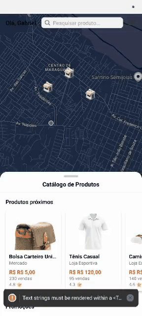

📱 Oxê Comprei

Conectando você aos comércios locais — de forma simples, rápida e regional.

O Oxê Comprei é um aplicativo mobile desenvolvido em React Native que facilita a descoberta de produtos e serviços oferecidos por comércios próximos. A proposta é aproximar usuário e comércio local, fortalecendo a economia regional e tornando a compra diária mais acessível e intuitiva.

✨ Funcionalidades atuais

🔐 Tela de Login
Autenticação simples e rápida para acesso ao app.

📝 Tela de Registro
Cadastro básico para novos usuários.

🏠 Tela Principal
Interface inicial contendo visão geral e opções principais.

🗺️ Mapa interativo (em construção)
Exibição de lojas e produtos próximos usando marcadores personalizados.

🎨 Design focado no usuário
Telas com tipografia personalizada e identidade visual regional.

🎯 Objetivo do Projeto

O Oxê Comprei nasce com a missão de valorizar o comércio local, conectando usuários aos estabelecimentos da sua região e trazendo praticidade no momento de encontrar produtos, comparar preços e visualizar localizações em um mapa interativo.

🛠️ Tecnologias Utilizadas

React Native

Expo

TypeScript

React Navigation

Expo Font

React Native Maps

Context API (em breve)

Firebase / Backend (planejado)

## 📱 Demonstração do App

📂 Estrutura do Projeto
/screen
  ├── Login.tsx
  ├── Registro.tsx
  ├── Home.tsx
  ├── PosRegistro.tsx
  ├── Welcome.tsx
/assets
  ├── fonts/
  ├── welcome/
  └── icons/
Splash.tsx
App.tsx
README.md

🚀 Como rodar o projeto
1. Clonar o repositório
git clone https://github.com/seu-usuario/oxe-comprei.git
cd oxe-comprei

2. Instalar dependências
npm install

3. Rodar o app
npx expo start

🔮 Futuras Funcionalidades

🛍️ Perfil de lojas e catálogo de produtos

📍 Marcadores 3D e animações avançadas no mapa

⭐ Sistema de avaliação dos comércios

🛒 Lista personalizada de produtos

🧾 Tela de pedidos e histórico

📢 Notificações sobre promoções locais

🤝 Contribuição

Sinta-se à vontade para abrir issues, enviar pull requests ou sugerir melhorias.
Toda contribuição é bem-vinda! 💛

📫 Contato

Caso queira trocar ideias, contribuir ou acompanhar o desenvolvimento:

Gabriel Moraes
🔗 www.linkedin.com/in/paulo-gabriel-688437222

Edilson Pereira da Silva Filho

Vitoria Frentas Bueno
